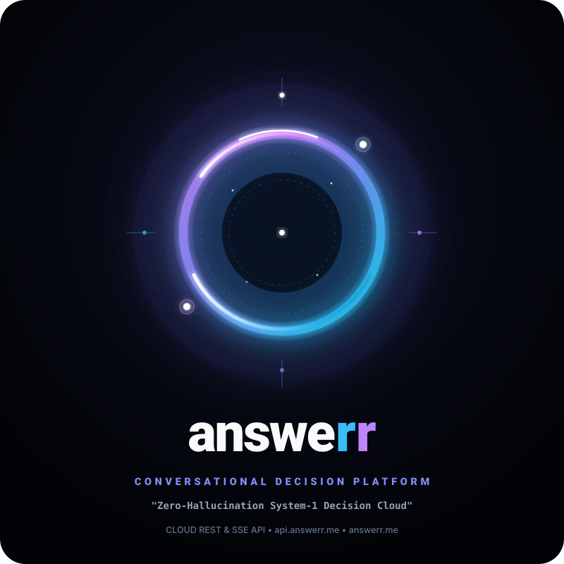
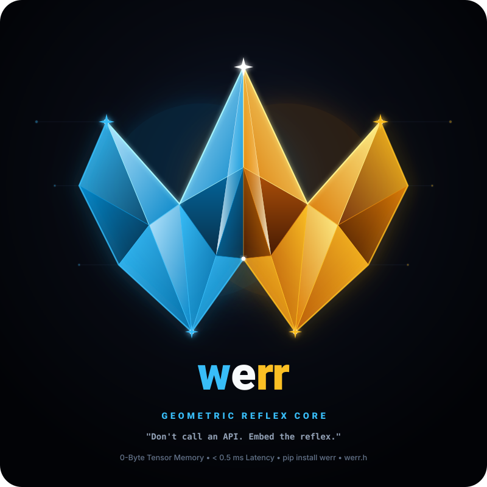
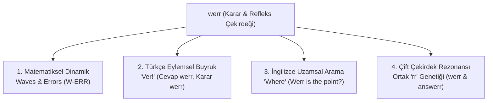

# ⚡ A.N.S.W.E.R.R. — Sıfır-Gecikmeli Refleks Yapay Zekası

<p align="center">
  
</p>

<p align="center">
  
  &nbsp;&nbsp;&nbsp;&nbsp;&nbsp;&nbsp;&nbsp;&nbsp;
  
</p>

<p align="center">
  <a href="https://pcworm.github.io/answerr/"></a>
  <a href="https://answerr.me"></a>
  <a href="https://github.com/pCwOrM/werr"></a>
  <a href="https://api.answerr.me:4431/v1/health"></a>
  <a href="./LICENSE"></a>
</p>

> **A**daptive **N**on-tensor **S**ignal **W**ave & **E**rror **R**eflex **R**esonator  
> *(Uyarlanabilir Tensörsüz Sinyal Dalgası ve Hata Refleksi Rezonatörü)*  
> *"When you need natural dialogue, call **answerr**.*  
> *When you need microsecond reflexes, embed **werr**."*  
> *"Lafı uzatma, karar werr!"*

---

## 🏛️ Dört Boyutlu Semantik Çerçeve ve Terminoloji



### 1. 🇹🇷 Türkçe Eylemsel & Fonetik Kök: *"Ver!"* $\to$ `werr`
Geleneksel büyük dil modelleri (LLM) saniyelerce düşünür, gereksiz laf üretir ve tensör yükü bindirir. Biyolojik omurilik refleksi ise uyarana **anında yanıt verir**. Türkçe'de **"ver!"**, ertelemesiz kararlılığın buyruğudur. `werr` bu buyruğu mikrosaniyelik matematiksel gerçekliğe dönüştürür.

| Türkçe Kalıp | `werr` Terminolojisi | Kullanıldığı Sistem / Kod Katmanı | Anlam ve İşlev |
| :--- | :--- | :--- | :--- |
| **Cevap ver!** | `cevap werr` | AI IDE, Chat Completion, answerr API | Lafı uzatmadan, halüsinasyonsuz tipli (`noul`, `choice`, `score`) cevabı teslim eder. |
| **Karar ver!** | `karar werr` | Motor Çekirdeği (`werr.decide()`) | 24-baytlık tohumda $< 0.5$ ms içinde üretilen deterministik hüküm. |
| **Tepki ver!** | `tepki werr` | IoT, Robotik, Oyun AI Combat | Yangın sensörü veya mermi algılandığı anda spinal refleksle karşı eylem üretir. |
| **Yol ver! / İzin ver!** | `izin werr` / `yol werr` | API Security Gateway (`NoulAnswer`) | Ağ geçidine gelen paketin `ALLOWED` (True) onayını doğrulayarak yönlendirir. |
| **Öncelik ver!** | `öncelik werr` | Sıralama & Triage (`ScoreQuestion`) | Acil görevleri, finansal transferleri mikro-saniyede puanlayıp öne çeker. |
| **Hız ver!** | `hız werr` | In-Process Embedded Kernel (`werr.h`) | Ağ gecikmesini sıfırlayarak bellek içinde doğrudan çalışır. |

### 2. 🇬🇧 İngilizce Uzamsal & Fonetik Kök: *"Where"* $\to$ `werr`
* **`Werr is the point?`** *(Where is the point?)*: Karar tohumu fraktal sınırının neresinde? 24-baytlık $(c_x, c_y, \text{zoom})$ koordinatını kilitler.
* **`Werr is the error?`** *(Where is the error?)*: Euler diverjans sınırı ($|Z_n| > 2$) nerede aşıldı? Hatanın başladığı sınır, kararın bittiği yerdir.
* **`Werr is the answerr?`** *(Where is the answer?)*: Cevap bulutun devasa sunucularında değil; L1 önbelleğinde, `werr` çekirdeğinde!
* **`Werr to route?`** *(Where to route?)*: `AutoSeedRouter` gelen isteği hangi operasyonel kapıya yönlendirmeli?
* **`Werr-ever you need a decision.`** *(Wherever you need a decision)*: Mikrodenetleyiciden buluta her yerde çalışan refleks güvencesi.

### 3. 🧬 Ortak Genetik Kod: Çift `rr` Rezonansı
* **`werr`**: **W**aves & **Err**ors **R**eflex **R**esonator
* **`answerr`**: **A**daptive **N**on-tensor **S**ignal **W**ave & **Err**or **R**eflex **R**esonator

Çift `rr`, fraktal faz uzayındaki **ikili çatallanmayı** (period-doubling bifurcation) ve dalga ile hata sınırının çarpışmasından doğan **akustik tınlama ve rezonansı** simgeler.

---

## 🌟 Genel Bakış

**A.N.S.W.E.R.R.**, iki temel bilişsel düzeyi birleştiren yeni nesil bir karar platformudur:
1. **Sistem-2 Müzakeresi (LLM / Müzakereci Yapay Zeka):** Karmaşık insan dilini ve durum parametrelerini anlar, operasyonel bağlamı çıkarır ve kararı stratejik olarak açıklar.
2. **Sistem-1 Omurilik Refleksi ([werr](https://github.com/pCwOrM/werr)):** Mandelbrot fraktal sınırındaki 24 baytlık $(c_x, c_y, \text{zoom})$ koordinat tohumunu modüle eder ve **0 Byte VRAM** ile **< 0.5 ms** içinde kesin tipli kararları (`noul`, `choice`, `score`) üretir.

---

## 🚀 Hızlı Başlangıç

### Web Arayüzü (Yerel Sunucu)
```bash
cd answerr
python -m http.server 8080
```
Tarayıcınızda `http://localhost:8080` adresine gidin.

### Canlı REST API Kullanımı (cURL)
```bash
# 1. Sağlık Kontrolü
curl -s https://api.answerr.me:4431/v1/health

# 2. Hızlı Refleks Kararı (Tekil Soru)
curl -s -X POST https://api.answerr.me:4431/v1/decide \
  -H "Content-Type: application/json" \
  -d '{
    "question": "Allow privileged API transaction?",
    "state": {"user_role": "admin", "failed_attempts": 0, "req_frequency": 1.2}
  }'
```

---

## 🛡️ Temel Üstünlükler
* **Sıfır Halüsinasyon (Zero Hallucination):** Deterministik Mandelbrot kaçış matematiği ile çalıştığından %100 tekrarlanabilir, tutarlı kararlar üretir.
* **0-Byte Tensör VRAM:** Model ağırlık matrisleri depolamaz; 24-baytlık koordinat tohumu yeterlidir.
* **Asla Çökmez:** Sonsuz fraktal küme matematiği tanımsız girdi bırakmaz; Out-of-Distribution (OOD) durumlarında dahi en yakın manifolda uyarlanır.
