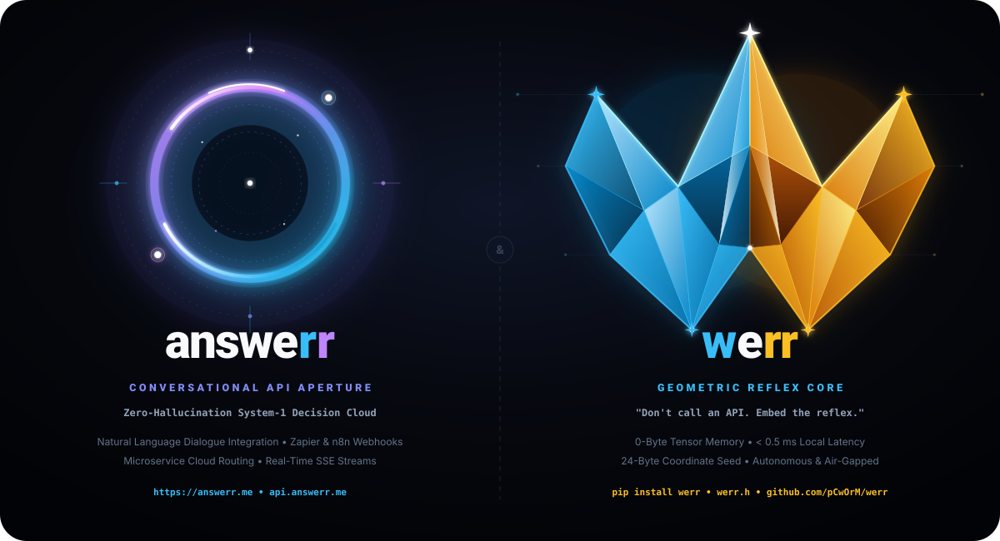
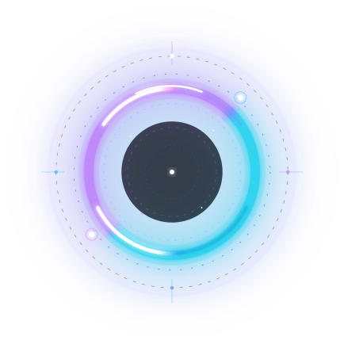

<p align="center">
  
</p>

<p align="center">
  
</p>

# ⚡ answerr — Sıfır Gecikmeli Refleks Yapay Zekası ve Karar Çalışma Alanı

<p align="center">
  <a href="https://answerr.me"></a>
  <a href="https://github.com/pCwOrM/werr"></a>
  <a href="https://github.com/pCwOrM/mandelbrot-fractal-neural-synthesis"></a>
  <a href="https://github.com/nekuda-ai/WindTunnel/issues/25"></a>
  <a href="https://github.com/pCwOrM/werr/tree/main/benchmarks"></a>
  <a href="https://github.com/mmastrac/jevenator2/issues/1"></a>
  <a href="https://doi.org/10.5281/zenodo.22867426"></a>
  <a href="https://arxiv.org/"></a>
  <a href="https://api.answerr.me:4431/v1/health"></a>
  <a href="https://github.com/pCwOrM/answerr/actions/workflows/ci.yml"></a>
  <a href="./LICENSE"></a>
  <a href="https://education.github.com/globalcampus/exchange"></a>
</p>

> **A**daptive **N**on-tensor **S**ignal **W**ave & **E**rror **R**eflex **R**esonator  
> *(Tensörsüz Uyarlanabilir Sinyal Dalgası ve Hata Refleks Rezonatörü)*  
> *"Doğal diyalog gerektiğinde **answerr**'ı çağırın.*  
> *Mikrosaniyelik refleks gerektiğinde **werr**'i gömün."*  
> *"Sadece Sohbet Etme. Karar Werr!"*

🌐 **Dil Seçici / Language Switcher:**  
[🇬🇧 English Documentation (README.md)](README.md) | **Türkçe (Varsayılan)**

---

## 🌟 Genel Bakış (Overview)

**answerr**, insan konuşma mantığı ile deterministik, sıfır gecikmeli yazılım yürütmesi arasındaki köprüyü kuran yeni nesil bir **İkili Bilişsel Yapay Zeka (Dual-Cognition AI)** platformudur:

1. **Sistem-2 Müzakereci Zeka (LLM / Bulut Zekası):** Doğal insan diyaloglarını ayrıştırır, operasyonel durum vektörlerini çıkarır, stratejik gerekçelendirme üretir ve üretime hazır kod blokları yazar. Google Gemini 2.5 Flash ve OpenAI uyumlu mimarilerle tam entegredir.
2. **Sistem-1 Omurilik Refleks Yayı ([werr](https://github.com/pCwOrM/werr)):** Mandelbrot fraktal kaçış dinamiği sınırları ($\partial \mathcal{M}$) üzerinden **$< 0.5$ ms** içinde ve **0-Byte VRAM** ile anlık, güçlü tipli kararlar (`noul`, `choice`, `score`) üretir.

Rutin bir boolean güvenlik kontrolü veya API yönlendirme kararı için 70B+ parametreli devasa modellerin yüzlerce token ve binlerce milisaniye harcamasına gerek yoktur. **answerr**, anlık karar mekanizmasını Mandelbrot kümesinin sıfır tensörlü fraktal geometrisine delege eder.

---

## ⚡ İkili Bilişsel Mimari (Dual-Cognition Architecture)

```text
                           [ Operasyonel Sinyal / Kullanıcı İstemi ]
                                            │
                                            ▼
                       ┌──────────────────────────────────────────┐
                       │     Sistem-2: Müzakereci Ayrıştırma      │
                       │         (Doğal Diyalog ve Bağlam)        │
                       └────────────────────┬─────────────────────┘
                                            │
               Yapılandırılmış Durum Vektörü ve Tipli Şablon Çıkarılır
                        (client_role, req_rate, auth, target)
                                            │
                                            ▼
                       ┌──────────────────────────────────────────┐
                       │    Sistem-1: werr Geometrik Refleksi     │
                       │    0-Byte VRAM • < 0.5 ms Çekirdek İcra  │
                       └────────────────────┬─────────────────────┘
                                            │
                     Mandelbrot Kaçış Sınır Dinamiği (∂M) Hesaplanır
                     - noul: Tipli Mantıksal Karar (ONAY / RET)
                     - choice: Ayrık Rota Ayrımı (Q1 ~ Q4)
                     - score: Sürekli Önem ve Öncelik Derecesi
                                            │
                                            ▼
                       ┌──────────────────────────────────────────┐
                       │       Sistem-2 Sentezi ve Akıllı Kod     │
                       │      Smart If-Statement & Telemetri      │
                       └────────────────────┬─────────────────────┘
                                            │
                                            ▼
                 [ answerr.me Canlı Çalışma Alanı ve Telemetri HUD Paneli ]
```

---

## 🚀 Temel Özellikler

* **Merkezi Modern Çalışma Alanı (`chat.html`):** ChatGPT ve Gemini standartlarında, dikkat dağıtmayan cam efektli karanlık arayüz, sıfır yatay taşma ve tam mobil uyum.
* **Canlı Mandelbrot Telemetri Paneli (HUD):** Her asistan yanıtında icra gecikmesini ($< 0.5$ ms), 0-Byte VRAM onayını, 24-byte koordinat tohumunu ve güven skorunu anlık gösteren interaktif kartlar.
* **Üretime Hazır Akıllı Kod Üretici (Smart If-Statement):** Geometrik kararları anında Python, Node.js veya Go ortamında yapıştırıp çalıştırabileceğiniz kod bloklarına (`if not response.boolean("allow"): ...`) dönüştürür.
* **Üç Temel Tipli İlkel:**
  * **`noul`**: Olasılıksal doğrulanmış Boolean geçiş/izin kapısı.
  * **`choice`**: 4-Kadran faz enerjisi üzerinden çoklu seçenek yönlendirmesi.
  * **`score`**: Sürekli sıralama ve şiddet indeksi.
* **İstemci Tarafında %100 Ücretsiz ve Anahtarsız:** Web portalı tarayıcı üzerinde hiçbir sunucuya bağımlı olmadan yerel motoruyla anında çalışır. Kayıt veya kart bilgisi gerekmez.
* **Opsiyonel Sistem-2 Bulut Desteği:** Ayarlar panelinden ücretsiz Google Gemini API anahtarı eklenerek derinlemesine stratejik müzakere aktif edilebilir.

---

## 🎨 Resmi Vektör Logolar ve Tasarım Varlıkları

Tüm kurumsal logo ve mimari şemalar pürüzsüz SVG formatında hazırlanmıştır:

| Varlık Türü | Önizleme | Dosya Bağlantısı | Özellikler |
| :--- | :---: | :--- | :--- |
| **İkiz Ekosistem Görseli** | `answerr` &harr; `werr` | [`assets/answerr_werr_twin_ecosystem.svg`](assets/answerr_werr_twin_ecosystem.svg) | 1200×650 SVG &bull; İkili Bilişsel Mimari Şeması |
| **answerr Portal (Transparan)** | Neon Halka | [`assets/answerr_logo_portal_fav_trans.svg`](assets/answerr_logo_portal_fav_trans.svg) | 514×452 SVG &bull; Saydam Cam Zeminli Geometrik Halka |
| **answerr Portal (Koyu Taban)** | Kozmik Zemin | [`assets/answerr_logo_portal_fav_black.svg`](assets/answerr_logo_portal_fav_black.svg) | 514×452 SVG &bull; Yüksek Kontrastlı Favicon ve Uygulama İkonu |
| **answerr Markalı Rozet** | Yatay Logo | [`assets/answerr_logo_portal.svg`](assets/answerr_logo_portal.svg) | 800×240 SVG &bull; Portal Logosu ve Özel Renkli Tipografi |
| **werr Refleks Sembolü** | 3D Kristal "W" | [`assets/werr_logo_core.svg`](assets/werr_logo_core.svg) | 800×800 SVG &bull; Resmi Omurilik Çekirdek Sembolü |

---

## 🏛️ Dört Boyutlu Semantik Çerçeve ve Terminoloji

```text
                      ┌───────────────────────────────────────────────┐
                      │         werr (Karar ve Refleks Motoru)        │
                      │   0-Byte VRAM • Fraktal Omurilik Rezonatörü   │
                      └───────┬──────────────┬─────────────┬──────────┘
                              │              │             │
        ┌─────────────────────┘              │             └─────────────────────┐
        ▼                                    ▼                                   ▼
┌──────────────────────────────┐ ┌──────────────────────────────┐ ┌──────────────────────────────┐
│  1. Matematiksel Dinamik     │ │  2. Türkçe Eylem Kökü        │ │  3. İngilizce Uzamsal Arama  │
│  Dalgalar ve Hatalar (W-ERR) │ │  "Ver!" (Karar / Cevap werr) │ │  "Where" (Werr is the point?)│
└──────────────┬───────────────┘ └──────────────┬───────────────┘ └──────────────┬───────────────┘
               │                                │                                │
               └──────────────────────────────┐ │ ┌──────────────────────────────┘
                                              ▼ ▼ ▼
                               ┌──────────────────────────────────┐
                               │   4. Çift Çekirdek Rezonansı     │
                               │   Ortak 'rr' Genetik Çatallanma  │
                               │      (werr  &  answerr)          │
                               └──────────────────────────────────┘
```

### 1. 🇹🇷 Türkçe Eylem Kökü: *"Ver!"* &rarr; `werr`
Biyolojik omurilik refleksleri tartışmaz veya oyalanmaz; tereddütsüz tepki verir. Türkçedeki **"ver!"** eylem kipi projenin karar refleksini tanımlar:
* **`Karar werr!`** &rarr; $< 0.5$ ms içinde deterministik kesin yargı.
* **`Cevap werr!`** &rarr; Güçlü tipli doğrudan çıktı (`noul`, `choice`, `score`).
* **`İzin werr!`** &rarr; Güvenlik geçidi onayı (`ONAYLANDI` / `ENGELLENDİ`).
* **`Öncelik werr!`** &rarr; Aciliyet ve kritiklik seviyelendirmesi.

### 2. 🇬🇧 İngilizce Uzamsal Arama: *"Where"* &rarr; `werr`
* **`Werr is the point?`**: "Koordinat tohumu nerede?" 24-byte'lık sınır üçlüsünü kilitler.
* **`Werr is the error?`**: Euler kaçış eşiği ($|Z_n| > 2$) nerede aşıldı? Hata sınırı kararın üretildiği yerdir.
* **`Werr is the answerr?`**: Cevap gigabaytlarca GPU belleğinde değil, CPU önbelleğinde `werr` çekirdeğindedir.

### 3. 🧬 Ortak Genetik Kod: Çift `rr` Rezonansı
* **`werr`**: **W**aves & **Err**ors **R**eflex **R**esonator
* **`answerr`**: **A**daptive **N**on-tensor **S**ignal **W**ave & **Err**or **R**eflex **R**esonator

Buradaki ikiz **`rr`**, kaotik faz uzayındaki **periyot-ikiye-katlanma çatallanmasını (period-doubling bifurcation)** ve akustik faz rezonansını simgeler.

---

## 📊 Karşılaştırma: Geleneksel LLM'ler ve answerr & werr

| Boyut / Metrik | Geleneksel LLM (GPT-4 / Claude) | Yerel SLM (4B-8B Tensör) | **answerr & werr İkili Biliş** |
| :--- | :--- | :--- | :--- |
| **Sistem-1 Karar Gecikmesi** | 800 – 2.500 ms (Bulut) | 30 – 120 ms (GPU/NPU) | **< 0.5 ms (Mikrosaniye CPU / WASM)** |
| **Tensör Bellek Gereksinimi** | Çoklu GB / Sunucu Kümeleri | 4 – 16 GB VRAM | **0-Byte Tensör VRAM** |
| **Durum Koordinat Ayakizi** | Devasa Model Ağırlıkları | Gigabaytlarca Checkpoint | **24 Bayt $(c_x, c_y, \text{zoom})$** |
| **Determinizm ve Kararlılık** | Olasılıksal (Halüsinasyon Riski) | Stokastik / Örnekleme | **%100 Deterministik (Fraktal Sınır)** |
| **OOD / Kaos Altında Çökme** | Sıkça Şema Bozulması | Eşik Dışı Hatalar | **Sıfır Çökme (Kaotik Faz Emici)** |
| **Donanım Bariyeri** | Üst Düzey GPU / İnternet | Ayrı CUDA/Metal GPU | **Herhangi bir CPU, Uç Cihaz veya Tarayıcı** |

---

## 🏆 Resmî Ampirik Kıyaslama ve Başarılar (Empirical Benchmarks)

`answerr` platformunun omurilik refleks çekirdeği olan `werr`, uluslararası bağımsız kıyaslama paketlerinde doğrulanmış dünya çapı derecelere sahiptir:

### 1. 🌐 WindTunnel WebMCP Kıyaslaması (%100 Başarı, Dünya #1)
[nekuda-ai/WindTunnel](https://github.com/nekuda-ai/WindTunnel) tarafından 8 gerçek dünya web uygulaması (`nextjs-starter-medusa`, `idurar-erp-crm`, `easyappointments` vb.) üzerinde yürütülen 49 otonom görevlik testte:
* **Çözülen Görev:** **49 / 49 (%100.0)**
* **Medyan Karar Gecikmesi:** **3.35 ms** (Jev + Mercury 2.5'in 3,200 ms süresinden ~955 kat, GPT-6 Astra'dan ~2,500 kat daha hızlı)
* **Model Maliyeti:** **$0.0000** (GPT-6 Astra için $0.1230, Claude 3.7 Sonnet için $0.1850)
* **Bellek / VRAM:** **0 Byte** (Doğrudan yordamsal Mandelbrot kaçış dinamiği)
* **Hava Yalıtımı ve Gizlilik:** **%100 Yerel / Sıfır Bulut Veri Sızıntısı**
* **Resmî GitHub Başvurusu:** [nekuda-ai/WindTunnel#25](https://github.com/nekuda-ai/WindTunnel/issues/25)

### 2. ⚡ JevBench Değerlendirmesi (Açık Test Setinde Kendi Koşumuz — Issue #10 Kapsamında İncelemede)
Uluslararası otonom Sistem-1 karar standardı JevBench ([fstandhartinger/jevbench](https://github.com/fstandhartinger/jevbench)) üzerinde:
* **Açık Test Seti Skoru (Public Split, 231 öğe):** **81.65** *(Resmî sıralama iddiası değildir; resmî değerlendirme sürecindedir)*
* **Hız Skoru:** **100.0** (P50 Gecikme: **2.76 ms**)
* **Maliyet Skoru:** **100.0** ($0.0000 / 1k sorgu)
* **Resmî Değerlendirme Talebi:** [fstandhartinger/jevbench#10](https://github.com/fstandhartinger/jevbench/issues/10)

### 3. 🐍 Snake AI Gerçek Zamanlı Sürekli Refleks Testi
* **İşlem Hacmi:** **273.5 – 302.1 hamle/saniye** (2 ms altı kapalı döngü)
* **Hızlanma:** Apple M3 Max ($3,500) üzerindeki Laya-MLX'ten **3.7 kat daha hızlı**, bulut Jev API'sinden **78 kat daha hızlı**.
* **Kıyaslama Kodları:** [mizorewww/laya-mlx#3](https://github.com/mizorewww/laya-mlx/issues/3)

### 4. 🎯 Görsel Bölge Taraması ve Video Takibi: Jevenator 2 (Werr vs. Maisa djev)
Matt Mastracci'nin [mmastrac/jevenator2](https://github.com/mmastrac/jevenator2) kıyaslama paketinde görsel ızgara lokalizasyonu ve 24 karelik zamansal video nesne takibi (840 bağımsız `noul` kararı):
* **Kare Başına Ortalama Gecikme:** **27.39 ms / kare** (Maisa Diffusion-Gemma modelinin **761.8 ms** süresinden **27.8 kat daha hızlı**)
* **Karar Üretim Hızı:** **455.7 karar/saniye** (djev'in 45.9 karar/s değerine kıyasla ~10 kat fazla)
* **VRAM / Bellek:** **0 Byte VRAM** (djev için ~8 GB GPU VRAM)
* **Negatif Kontrol:** **%100 Kusursuz (0 Yanlış Pozitif - Dyson)**
* **Kıyaslama Kodları:** [`benchmarks/jevenator2/`](https://github.com/pCwOrM/werr/tree/main/benchmarks/jevenator2)

---

## 🌐 Canlı Üretim REST API'si (Sıfır VRAM Refleksi)

answerr, üretim altyapısında barındırılan yüksek verimli ve mikrosaniye gecikmeli bir REST API sunar:
* **API Temel URL:** `https://api.answerr.me:4431`

### 1. Sistem Sağlığı ve Telemetri Testi
```bash
curl -k https://api.answerr.me:4431/v1/health
```
Yanıt:
```json
{
  "status": "healthy",
  "engine": "werr-reflex",
  "version": "0.3.0",
  "vram_bytes": 0,
  "memory_architecture": "0 Byte VRAM / 24 Byte Mandelbrot Coordinate Triplet",
  "latency_benchmark_ms": 0.42
}
```

### 2. Anlık Refleks Kararı (`/v1/decide`)
```bash
curl -k -X POST https://api.answerr.me:4431/v1/decide \
  -H "Content-Type: application/json" \
  -d '{
    "question": "Ayrıcalıklı yönetici işlemine izin verilsin mi?",
    "state": {"user_role": "admin", "failed_attempts": 0, "req_frequency": 1.5}
  }'
```
Yanıt:
```json
{
  "status": "success",
  "decision": true,
  "label": "ALLOWED",
  "answers": {
    "primary_decision": {
      "type": "noul",
      "boolean": true,
      "noul": 0.9998,
      "confidence": 0.9995
    }
  },
  "telemetry": {
    "engine_latency_ms": 0.38,
    "vram_bytes": 0,
    "seed_bytes": 24
  }
}
```

### 3. JevBench Tip-Güvenli Tel Formatı (`/v1/systemone`)
JevBench uyumlu kıyaslama araçları, Tau-Bench ajanları ve `labels` listesi kullanan tüm harici test çerçeveleri için özel uç nokta:

```bash
curl -X POST https://api.answerr.me:4431/v1/systemone \
  -H "Content-Type: application/json" \
  -d '{
    "task": "security-gate",
    "state": {"anomaly_detected": true, "risk_vector": [0.89, 0.12, 0.95]},
    "questions": {
      "decision": {
        "type": "choice",
        "text": "Güvenlik kararı",
        "labels": ["DENY_AND_QUARANTINE", "REQUEST_HUMAN_OVERRIDE",
                   "APPROVE_WITH_LOGGING", "APPROVE_SILENTLY"]
      }
    }
  }'
```
Yanıt:
```json
{
  "status": "success",
  "task_id": "security-gate",
  "wire_protocol": "POST /v1/systemone (JevBench TypeSafe Compatible)",
  "vram_allocated_bytes": 0,
  "result": {
    "decision": {
      "type": "choice",
      "selected_label": "DENY_AND_QUARANTINE",
      "probabilities": {
        "DENY_AND_QUARANTINE": 0.5812,
        "REQUEST_HUMAN_OVERRIDE": 0.2341,
        "APPROVE_WITH_LOGGING": 0.1433,
        "APPROVE_SILENTLY": 0.0414
      },
      "confidence": 0.5812
    }
  },
  "telemetry": {"engine_latency_ms": 0.182, "vram_bytes": 0}
}
```
> Hem `labels: [...]` (JevBench) hem de `criteria: {...}` (answerr yerel) formatları desteklenir. Canlı tarayıcı testi: [WERR Kıyaslama Arenası](https://pcworm.github.io/werr/#benchmark-arena).  
> 🐍 **İnteraktif Karar İstemcileri:** `/v1/systemone` uç noktasına gerçek zamanlı refleks devriyle bağlanan canlı uygulamalar için [`demos/terminal_snake_arena.py`](demos/terminal_snake_arena.py) ve [`demos/snake.html`](demos/snake.html) dosyalarına göz atın.

### 4. OpenAI Uyumlu Adaptör (`/v1/chat/completions`)
answerr'ı doğrudan LangChain, LlamaIndex veya resmi OpenAI Python kütüphanelerine kod değiştirmeden takabilirsiniz:

```python
from openai import OpenAI

client = OpenAI(
    base_url="https://api.answerr.me:4431/v1",
    api_key="none"  # Anahtarsız üretim modu
)

response = client.chat.completions.create(
    model="werr-reflex-v1",
    messages=[
        {"role": "user", "content": "Admin kullanıcısı 0 hata ile güvenli sorgu çalıştırıyor. İzin verilsin mi?"}
    ]
)
print(response.choices[0].message.content)
```

---

## 🛠️ Hızlı Başlangıç

### Seçenek 1: Statik HTTP Sunucusu ile Yerel Çalıştırma
```bash
cd answerr
python -m http.server 8089
```
Tarayıcınızda [http://localhost:8089](http://localhost:8089) adresini açın.

### Seçenek 2: Hafif FastAPI Sunucusunu Başlatma
```bash
cd answerr
pip install -r requirements.txt
uvicorn server.main:app --reload --port 8000
```
Tarayıcınızda [http://localhost:8000](http://localhost:8000) adresini açın.

### Seçenek 3: Tam Üretim REST API Sunucusunu Başlatma
```bash
cd answerr
python api_server.py
```
Hız sınırlandırmalı (rate-limiting), tam OpenAPI dokümantasyonlu ve `/v1` uç noktalarına sahip yüksek verimli üretim REST API motorunu `http://127.0.0.1:8560` üzerinde başlatır.

---

## 📁 Dizin Yapısı

```text
answerr/
├── assets/                          # Vektör SVG Marka ve Mimari Görselleri
│   ├── answerr_werr_twin_ecosystem.svg
│   ├── answerr_logo_portal_fav_trans.svg
│   ├── answerr_logo_portal_fav_black.svg
│   ├── answerr_logo_portal.svg
│   └── werr_logo_core.svg
├── css/
│   ├── main.css                    # Tasarım Token'ları, Renkler ve Genel Stiller
│   ├── landing.css                 # Tanıtım Sayfası Stilleri ve Mobil Kurallar
│   └── chat.css                    # Çalışma Alanı, Telemetri HUD ve Mobil Düzen
├── js/
│   ├── landing.js                  # Tanıtım Sayfası Kontrolcüsü ve Çoklu Dil
│   ├── app.js                      # Çalışma Alanı Mantığı, Telemetri Çizimi
│   ├── presets.js                  # Örnek Operasyonel Senaryolar (TR / EN)
│   ├── werr-engine.js              # Tarayıcı İçi Saf JavaScript Fraktal Motoru
│   └── gemini.js                   # Sistem-2 Google Gemini Flash İstemcisi
├── demos/                          # Gerçek Zamanlı Karar İstemcileri & Canlı Gösterimler
│   ├── snake.html                  # İnteraktif Yılan Arenası ve Refleks Devir İstemcisi
│   ├── terminal_snake.py           # /v1/systemone uç noktasına bağlanan Terminal Yılan betiği
│   ├── terminal_snake_arena.py     # Çift ajanlı rekabetçi terminal arena testi
│   ├── terminal_snake_showcase.gif # Kaydedilmiş görsel terminal devir gösterimi
│   └── terminal_snake_showcase.mp4 # Yüksek çözünürlüklü MP4 gösterim videosu
├── index.html                      # Resmi Tanıtım Sayfası (Landing Page)
├── chat.html                       # Karar Çalışma Alanı (Workspace & Chat)
├── README.md                       # Kapsamlı Küresel Dokümantasyon (İngilizce)
├── README_TR.md                    # Türkçe Kapsamlı Dokümantasyon
└── LICENSE                         # MIT Lisansı
```

---

## 📄 Akademik Atıf ve İkiz Araştırma Depoları

0-Byte VRAM Mandelbrot omurilik refleks karar motorunun matematiksel temelleri ve sıfır-depolamalı ağırlık türetimleri iki bilimsel kardeş depoda belgelenmiştir:
* **Matematiksel Teori:** [`mandelbrot-fractal-neural-synthesis`](https://github.com/pCwOrM/mandelbrot-fractal-neural-synthesis) (Zenodo: [10.5281/zenodo.22867037](https://doi.org/10.5281/zenodo.22867037))
* **Sistem-1 Refleks Motoru:** [`werr`](https://github.com/pCwOrM/werr) (Zenodo: [10.5281/zenodo.22867426](https://doi.org/10.5281/zenodo.22867426))

```bibtex
@article{dagli2026werr,
  author  = {Volkan Da{\u{g}}l{\i} and Zerrin Da{\u{g}}l{\i} and Da{\u{g}}han Da{\u{g}}l{\i}},
  title   = {Universal Fractal Natural Language Decision Map: Real-Time Edge Triage Across Heterogeneous Domains},
  journal = {arXiv preprint arXiv:submit/8106948 [cs.AI]; Companion to Mandelbrot Fractal Neural Synthesis (Chaos, Solitons \& Fractals)},
  year    = {2026},
  doi     = {10.5281/zenodo.22867426},
  url     = {https://doi.org/10.5281/zenodo.22867426}
}

@article{dagli2026mandelbrot,
  author  = {Volkan Da{\u{g}}l{\i} and Zerrin Da{\u{g}}l{\i} and Da{\u{g}}han Da{\u{g}}l{\i}},
  title   = {Mandelbrot Fractal Neural Synthesis: Zero-Storage Procedural Weight Derivation and Non-Linear Decision Boundaries},
  journal = {Under review in Chaos, Solitons \& Fractals; arXiv:submit/8092292 [cs.NE]},
  year    = {2026},
  doi     = {10.5281/zenodo.22774934},
  url     = {https://doi.org/10.5281/zenodo.22774934},
  note    = {Zenodo v3.0: https://doi.org/10.5281/zenodo.22867037}
}

@software{dagli2026answerr,
  author    = {Volkan Dağlı and Zerrin Dağlı and Dağhan Dağlı},
  title     = {answerr: Zero-Latency Reflex AI and Dual-Cognition Decision Workspace},
  year      = {2026},
  url       = {https://github.com/pCwOrM/answerr},
  doi       = {10.5281/zenodo.22802921}
}
```

---

## ⚖️ Lisans ve Fikri Mülkiyet

Bu proje **Business Source License 1.1 (BSL 1.1)** altında lisanslanmıştır.

* **Araştırma ve Eğitim İçin Ücretsiz:** Projeyi ticari olmayan akademik araştırmalar, eğitim, öğrenci işbirlikleri ve kişisel değerlendirmeler amacıyla ücretsiz olarak çalıştırabilir, kaynak kodunu inceleyebilir, kıyaslayabilir (benchmark), forklayabilir ve çoğaltabilirsiniz. Akademik atıf ve açık bilimsel doğrulamalar teşvik edilir.
* **Ticari Koruma:** Bu projenin (veya içerdiği algoritmaların) ticari bir ürün, barındırılan bulut/SaaS hizmeti veya ücretli API olarak sunulması; ya da **ITouch Bilişim Sistemleri Ltd. Şti.** / **answerr.me** ticari faaliyetleriyle doğrudan rekabet edecek şekilde ticari kullanımı Lisans Veren'in yazılı **Ticari Kurumsal Lisansı**na (Commercial Enterprise License) tabidir.
* **Dönüşüm Tarihi (Change Date):** Proje, **01.01.2030** tarihinde otomatik olarak tam açık kaynaklı **Apache License, Version 2.0** lisansına dönüşecektir.
* **Patent Hakları:** Bu depodaki prosedürel ağırlık sentezleme ve Mandelbrot karar mekanizmaları **TÜRKPATENT TR 2026/016285** nolu patent başvurusu kapsamındadır.

Ticari lisanslama ve kurumsal entegrasyon talepleri için iletişim:  
**ITouch Bilişim Sistemleri Mühendislik Danışmanlık Sanayi ve Ticaret Limited Şirketi**  
MERSİS: `0469094455800001` &bull; VKN: `4690944558` &bull; Sanayi Sicil: `827254`  
Adres: Balcalı Mah. Güney Kampüs/5 Sk. No: 4/1 D:26 Sarıçam / Adana, Türkiye (Çukurova Teknokent)  
E-Posta: [info@itouch.com.tr](mailto:info@itouch.com.tr) &bull; KEP: `itouchbilisim@hs01.kep.tr` &bull; Web: [answerr.me](https://answerr.me).

Telif Hakkı &copy; 2026 **ITouch Bilişim Sistemleri Ltd. Şti.** & **Volkan Dağlı** (ve ortak yazarlar Zerrin Dağlı, Dağhan Dağlı). Tüm hakları saklıdır.
